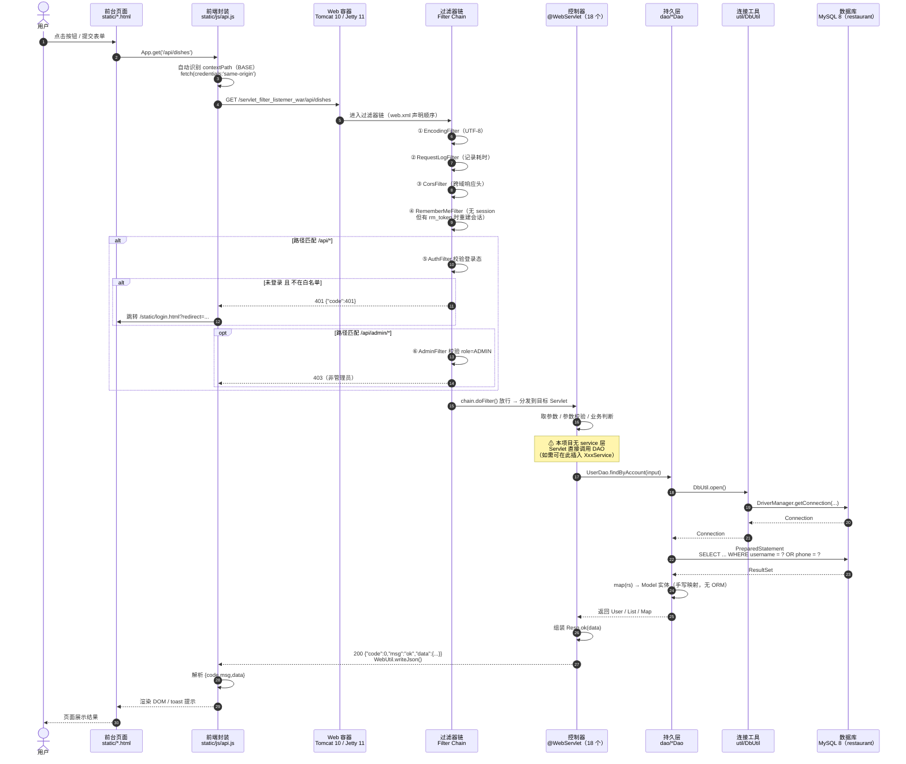
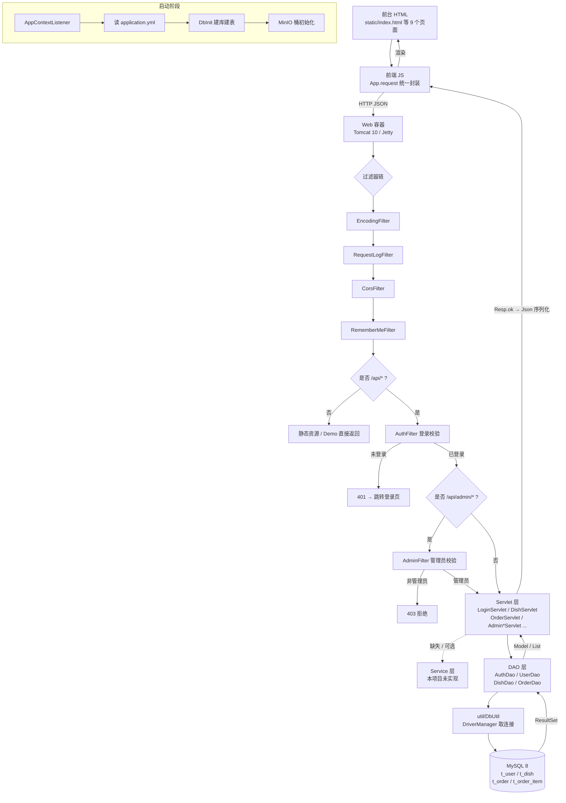

# 味知源餐厅点餐系统

零框架实现：**JavaSE + Servlet + Filter + Listener + 原生 JDBC + MySQL + Cookie/Session + MinIO**
前端为原生 **HTML / CSS / JavaScript**，与后端完全分离（静态文件统一放在 `static` 目录，后端只提供 `/api` JSON 接口）。

## 一、技术栈说明

| 层次 | 实现 | 说明 |
| --- | --- | --- |
| Web 层 | Servlet（`HttpServlet`） | 全部通过 `@WebServlet` / `@MultipartConfig` 注解声明 |
| 拦截层 | Filter | 编码、请求日志、CORS、记住我自动登录、登录拦截、管理员鉴权 |
| 监听层 | Listener | `ServletContextListener` / `HttpSessionListener` / `ServletRequestListener` / `HttpSessionAttributeListener` |
| 会话 | Cookie + Session | 登录态 Session，"记住我"用 Cookie 令牌入库；浏览历史用 Cookie |
| 持久层 | 原生 JDBC | `DriverManager` + `PreparedStatement` + JDBC 事务（下单扣库存、取消回滚库存） |
| 数据库 | MySQL 8 | `root / 412826`，启动自动建库建表与演示数据 |
| 对象存储 | MinIO | 头像 / 菜品图片，启动自动建桶，不可用时自动降级本地磁盘 |
| 前端 | HTML + CSS + 原生 JS | `fetch` 调用接口，无任何前端框架 |
| 容器 | Jetty 11 / Tomcat 10 | `mvn jetty:run` 开发调试，或打出 war 部署 |

> 未使用 Spring、MyBatis、Jackson、SnakeYAML 等任何第三方框架，**JSON 解析与 YAML 配置解析均为手写实现**（见 `util/Json.java`、`config/AppConfig.java`）。

## 二、目录结构

```
servlet-filter-listemer/
├── pom.xml                             # 仅 4 个依赖：servlet-api / mysql-connector / minio / jetty 插件
├── README.md                           # 项目说明（含流程图）
├── md/                                 # 文档
│   ├── 01-技术架构文档.md
│   ├── 02-流程图.md                    # 13 张 Mermaid 图
│   └── 03-未来扩展规划.md
├── sql/schema.sql                      # 独立建表脚本（与 resources/db/schema.sql 同源）
└── src/main/
    ├── java/org/example/restaurant/
    │   ├── config/
    │   │   └── AppConfig.java          # 手写 YAML 解析，支持 ${ENV:default} 占位符
    │   ├── util/                       # 7 个工具类（无任何第三方库）
    │   │   ├── Json.java               # 手写 JSON 序列化/解析（反射 public 字段）
    │   │   ├── DbUtil.java             # JDBC 唯一出口：DriverManager 取连接
    │   │   ├── DbInit.java             # 建库建表、补列、灌种子数据
    │   │   ├── PasswordUtil.java       # SHA-256(salt + 明文)
    │   │   ├── WebUtil.java            # 写 JSON 响应、取请求体、参数校验
    │   │   ├── Resp.java               # 统一响应体 {code, msg, data}
    │   │   └── MinioStore.java         # 对象存储上传 + 本地降级
    │   ├── model/                      # 6 个实体：public 字段，无 getter/setter
    │   │   └── User / Dish / Cart / CartItem / Order / OrderItem
    │   ├── dao/                        # 原生 JDBC，手写 SQL（4 个）
    │   │   ├── AuthDao.java            # 验证码、登录令牌
    │   │   ├── UserDao.java            # 用户 CRUD、后台用户管理
    │   │   ├── DishDao.java            # 菜品 CRUD、库存扣减
    │   │   └── OrderDao.java           # 下单事务、状态流转、营收聚合
    │   ├── filter/                     # 6 个过滤器（web.xml 声明顺序即执行顺序）
    │   │   └── Encoding / RequestLog / Cors / RememberMe / Auth / Admin
    │   ├── listener/                   # 4 个监听器
    │   │   ├── AppContextListener      # 启动：加载 yml → 建表 → MinIO 建桶
    │   │   ├── OnlineUserListener      # 会话级：在线人数
    │   │   ├── RequestStatListener     # 请求级：PV / 耗时统计
    │   │   └── LoginAuditListener      # 属性级：登录审计
    │   ├── servlet/                    # 18 个 @WebServlet（注解注册，不在 web.xml）
    │   │   ├── 认证：Register / Login / Logout / PhoneCode / PhoneLogin / Me
    │   │   ├── 业务：Dish / Cart / Order / User / Avatar
    │   │   ├── 后台：AdminDish / AdminOrder / AdminUser / AdminIncome
    │   │   └── 运维：Health / Stat / Error
    │   └── demo/
    │       └── UserServlet1.java       # 教学 Demo：表单查 t_user 判登录成败
    ├── resources/
    │   ├── application.yml             # 数据库与 MinIO 配置（支持环境变量覆盖）
    │   └── db/schema.sql               # 6 张表 DDL，启动自动执行
    └── webapp/
        ├── WEB-INF/web.xml             # Listener / Filter / welcome-file / 错误页
        └── static/                     # 前后端分离的静态前端（8 个页面）
            ├── index.html    点餐首页
            ├── login.html / register.html    登录 / 注册
            ├── orders.html   我的订单
            ├── profile.html  个人中心
            ├── admin.html    后台管理（菜品/订单/用户/收入）
            ├── demo.html     Servlet 教学 Demo 页
            ├── 404.html      错误页
            ├── css/common.css
            └── js/          10 个：api.js（fetch 封装）index / auth / orders /
                             profile / admin / admin-common / admin-order /
                             admin-user / admin-income
```

## 三、运行步骤

### 1. 准备环境

- JDK 21、Maven 3.9+
- MySQL 8：账号 `root`、密码 `412826`（若不同，修改 `application.yml` 的 `db.password`）
- MinIO（可选）：默认 `http://127.0.0.1:9000`，账号密码 `minioadmin/minioadmin`，桶 `im-files`

### 2. 修改配置：`src/main/resources/application.yml`

```yaml
db:
  url: ${DB_URL:jdbc:mysql://127.0.0.1:3306/restaurant?...}
  username: ${DB_USERNAME:root}
  password: ${DB_PASSWORD:412826}
  auto-init: true          # 启动自动建库 / 建表 / 灌入演示数据

minio:
  endpoint: ${MINIO_ENDPOINT:http://127.0.0.1:9000}
  access-key: ${MINIO_ACCESS_KEY:minioadmin}
  secret-key: ${MINIO_SECRET_KEY:minioadmin}
  bucket: ${MINIO_BUCKET:im-files}
  fallback-local: true     # MinIO 不可用时降级保存到 static/uploads
```

所有配置项都支持环境变量覆盖，例如：`set MINIO_ENDPOINT=http://192.168.1.9:9000`。

### 3. 启动

```bash
# 方式一：内嵌 Jetty 运行（默认端口 8081，可通过 -Djetty.port=xxxx 修改）
mvn clean compile jetty:run
# 浏览器访问：http://127.0.0.1:8081/

# 方式二：打成 war 部署到 Tomcat 10
mvn clean package
# 把 target/restaurant.war 拷到 tomcat/webapps 下即可（访问路径 /restaurant）
```

### 4. 演示账号

| 账号 | 密码 | 角色 |
| --- | --- | --- |
| admin | 123456 | 管理员（可进入后台管理） |
| tom | 123456 | 普通用户 |

> 演示环境未接短信网关，手机号验证码会直接回显在页面上，同时打印在控制台日志中。

## 四、核心功能

- **注册**：服务端全量校验（长度、格式、重复），失败时返回 `errors` 与已填 `form` 数据，前端字段级高亮并回显
- **登录**：用户名 / 手机号均可；勾选"记住我"下发 `rm_token` Cookie（30 天），由 `RememberMeFilter` 实现关浏览器后自动登录
- **手机号登录**：`/api/auth/phone/code` 获取验证码 → `/api/auth/phone/login` 登录，未注册手机号自动建号
- **点餐**：菜品分类筛选、关键字搜索、加入购物车（Session 存储），库存校验
- **下单**：JDBC 事务同时写订单、明细并扣减库存，失败整体回滚；取消订单自动返还库存
- **个人中心**：资料回显、修改，头像上传 MinIO 后实时刷新
- **后台管理**：菜品增删改查与上下架（ADMIN 角色），支持表单校验回显
- **运维信息**：`/api/health` 查看 MySQL / MinIO 连通性；在线人数、PV 由 Listener 实时统计

## 五、主要接口

| 方法 | 路径 | 说明 | 登录 |
| --- | --- | --- | --- |
| POST | `/api/auth/register` | 注册（失败回显 form + errors） | 否 |
| POST | `/api/auth/login` | 账号密码登录（记住我） | 否 |
| POST | `/api/auth/phone/code` | 获取短信验证码 | 否 |
| POST | `/api/auth/phone/login` | 手机号验证码登录/自动注册 | 否 |
| GET | `/api/auth/logout` | 退出登录 | 是 |
| GET | `/api/auth/me` | 当前用户、购物车数量、在线人数 | 否（自动判断） |
| GET | `/api/dishes` | 菜品列表（category / keyword / id） | 否 |
| GET/POST/DELETE | `/api/cart` | 购物车增删改 | 是 |
| GET/POST/DELETE | `/api/orders` | 订单列表 / 下单 / 取消 | 是 |
| GET/POST | `/api/user/profile` | 资料回显与保存 | 是 |
| POST | `/api/user/avatar` | 头像上传（multipart → MinIO） | 是 |
| GET/POST/PUT/DELETE | `/api/admin/dish` | 菜品管理 | 管理员 |
| GET | `/api/health` | 健康检查 | 否 |
| GET | `/api/stat/online` | 在线人数、PV、接口访问排行 | 否 |

统一响应结构：`{ "code": 0, "msg": "ok", "data": {...} }`，`code != 0` 表示业务失败。

## 六、项目文档（md 目录）

| 文档 | 内容 |
| --- | --- |
| [md/01-技术架构文档.md](md/01-技术架构文档.md) | 分层架构、包职责、核心类说明、设计取舍 |
| [md/02-流程图.md](md/02-流程图.md) | 13 张 Mermaid 流程图：部署拓扑、启动初始化、过滤器链、两种登录、下单事务、订单状态机、文件上传、统计旁路、错误处理、后台四大模块，**以及全链路时序图（第 12 节）与分层数据流向图（第 13 节）** |
| [md/03-未来扩展规划.md](md/03-未来扩展规划.md) | 后续演进方向：连接池、Service 层、Redis、Spring Boot 迁移等 |

> 阅读器不支持 Mermaid 时，可把代码块粘到 https://mermaid.live 查看。

## 七、常见问题

- **8081 端口被占用**：`mvn jetty:run -Djetty.port=8090`
- **MySQL 连接失败**：确认服务已启动、账号密码为 `root/412826`，或执行 `sql/schema.sql` 手工建表；排查接口 `GET /api/health`
- **MinIO 不可用**：不影响点餐主流程，头像会自动降级保存到本地 `webapp/static/uploads`
- **数据表重建**：删除 `restaurant` 库后重启应用，会自动重新初始化（含 12 道演示菜品）

---

## 八、核心流程图

> 完整 13 张图见 [md/02-流程图.md](md/02-流程图.md)；不支持 Mermaid 时可粘到 https://mermaid.live 查看。

### 1. 全链路请求时序（前台 → 过滤器 → Servlet → DAO → 数据库 → 返回）



### 2. 分层架构与数据流向（含 service 层说明）



### 各层职责与现状

| 层次 | 本项目实现 | 说明 |
| --- | --- | --- |
| 表现层 | `static/*.html` + `static/js/*.js` | 原生 HTML/JS，无框架；`api.js` 统一封装 fetch |
| 过滤器层 | `filter/` 6 个 | 编码、日志、跨域、自动登录、鉴权、管理员权限 |
| 控制器层 | `servlet/` 18 个 | `@WebServlet` 注解注册，负责取参 / 校验 / 响应 |
| 持久层 | `dao/` 4 个 | 手写 JDBC + `PreparedStatement`，无 ORM、无连接池 |
| 数据源 | `util/DbUtil` | 唯一 `DriverManager.getConnection` 出口 |
| 数据库 | MySQL 8 | 6 张表，DDL 在 `db/schema.sql` |

### 4.数据流

```
浏览器 fetch
  → Filter 链（编码/跨域/恢复会话/鉴权）     ← Filter
  → @WebServlet（取参、校验、拼响应）        ← Servlet
  → dao（手写 SQL、事务）                    ← JDBC
  → DbUtil.open() → MySQL
  ↑
  Listener 在启动时已把配置和表准备好      ← Listener
  Session/Cookie 全程携带用户身份           ← Cookie+Session
```

