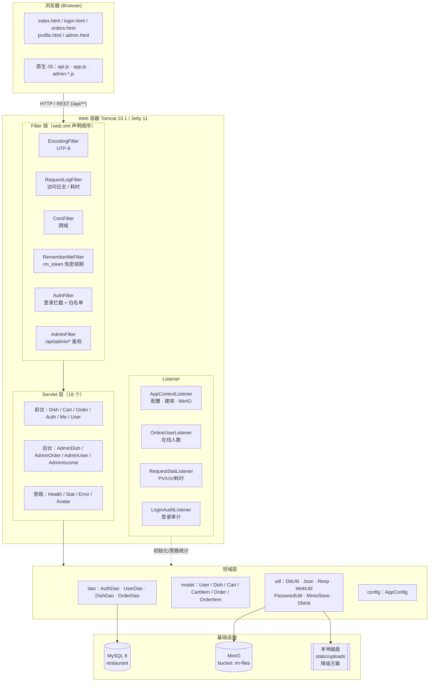
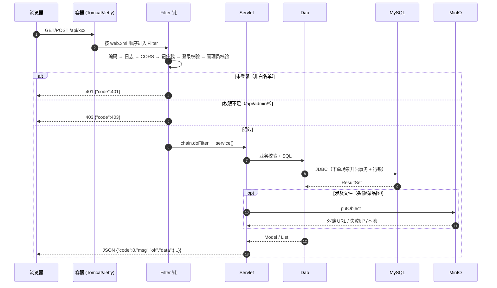
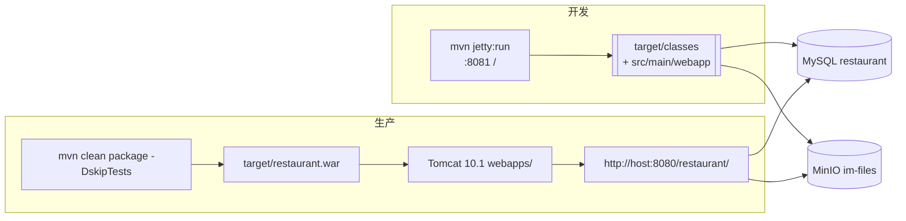

# 技术架构文档 — 味知源餐厅点餐系统

> 项目坐标：`org.example:servlet-filter-listemer:1.0-SNAPSHOT`，打包方式 `war`，finalName `restaurant`
> 文档版本：2026-09-17

---

## 1. 项目概述

一个**零框架**的 Java Web 餐厅点餐系统：只用 JDK 21 + Jakarta Servlet 5.0 原生 API（`Servlet` / `Filter` / `Listener`）+ 原生 JDBC + 原生 HTML/CSS/JS，实现前台点餐、购物车、下单、会员中心与后台管理（菜品 / 订单 / 用户 / 收入）。

**没有** Spring / MyBatis / Hibernate / Redis / RabbitMQ / Tomcat Embed / 任何连接池，`application.yml`、JSON、密码加盐、 responding 封装全部手写。

### 1.1 技术选型

| 层次 | 技术 | 版本 | 说明 |
|---|---|---|---|
| 运行 | JDK | **21** | `maven.compiler.source/target = 21`，class 文件版本 65 |
| Web 规范 | Jakarta Servlet API | **5.0.0** | `provided` 作用域，由容器提供 |
| 开发容器 | Eclipse Jetty（jetty-maven-plugin） | **11.0.20** | `mvn jetty:run`，端口 `8081`，contextPath `/` |
| 生产容器 | Tomcat | **10.1 / 11.x** | 部署 `restaurant.war`；**必须跑在 JDK 21 上** |
| 数据库 | MySQL | **8.x** | mysql-connector-j 8.4.0，原生 JDBC `DriverManager` |
| 对象存储 | MinIO | SDK 8.5.9 | 头像 / 菜品图；不可用时降级本地 `static/uploads` |
| 构建 | Maven | 3.9.x | war 插件 3.4.0 |
| 前端 | 原生 HTML/CSS/JS | — | `src/main/webapp/static`，无 Vue/React |
| 配置 | 自写 YAML 读取器 | — | `config/AppConfig`（纯 JavaSE，不引 SnakeYAML） |
| 序列化 | 自写 JSON 解析/生成器 | — | `util/Json`（不引 Jackson/Gson） |

### 1.2 为什么 README 里看到 `application.yml` 却说是无框架？

`.yml` 只是普通文本文件。`AppConfig` 用 60 行 JavaSE 代码实现了「缩进层级 → 点分 key」的解析 + `${ENV:默认值}` 占位符替换（优先级：`System.getProperty` → `System.getenv` → 默认值），再统一由监听器在启动时装配进 `ServletContext`。

---

## 2. 总体架构

### 2.1 分层架构图



### 2.2 请求处理链路



---

## 3. 源码结构

```
src/main/
├── java/org/example/restaurant/
│   ├── config/    AppConfig                     自写 YAML 读取器 + ${} 占位符
│   ├── listener/  AppContextListener            启动入口：加载配置、建库建表、种子数据、创建 MinIO 桶
│   │              OnlineUserListener            HttpSessionListener：在线人数
│   │              RequestStatListener           ServletRequestListener：PV/UV/耗时
│   │              LoginAuditListener            ServletContextAttributeListener：登录/登出审计
│   ├── filter/    EncodingFilter  RequestLogFilter  CorsFilter
│   │              RememberMeFilter  AuthFilter  AdminFilter
│   ├── servlet/   HealthServlet  StatServlet  ErrorServlet  DishServlet  CartServlet
│   │              OrderServlet   LoginServlet  LogoutServlet  RegisterServlet
│   │              PhoneCodeServlet  PhoneLoginServlet  MeServlet  UserServlet  AvatarServlet
│   │              AdminDishServlet  AdminOrderServlet  AdminUserServlet  AdminIncomeServlet
│   ├── dao/       AuthDao  UserDao  DishDao  OrderDao        原生 JDBC，全部 static 方法
│   ├── model/     User  Dish  Cart  CartItem  Order  OrderItem
│   └── util/      DbUtil  DbInit  Json  Resp  WebUtil  PasswordUtil  MinioStore
├── resources/
│   ├── application.yml                         应用配置（db / minio / app）
│   └── db/schema.sql                           6 张表的 DDL + 种子数据脚本
└── webapp/
    ├── static/  index / login / register / orders / profile / admin / 404
    │            css/common.css  js/api.js · app.js · admin-{dish,order,user,income}.js
    └── WEB-INF/web.xml                         Listener / Filter / welcome-file / error-page
```

---

## 4. 模块职责

### 4.1 Listener（4 个）

| 类 | 生命周期 | 职责 |
|---|---|---|
| `AppContextListener` | 应用级 `ServletContextListener` | ①`AppConfig.load("application.yml")` ②`DbInit` 建库建表 + 菜品种子数据 + 版本差异补列（`t_user.status`）③创建 MinIO 桶 ④把 `appName`/`appConfig` 放进 `ServletContext` |
| `OnlineUserListener` | 会话级 `HttpSessionListener` | session 创建/销毁时增减计数器，供 `/api/stat/online` 与后台展示在线人数 |
| `RequestStatListener` | 请求级 `ServletRequestListener` | PV、UV（按 IP/UA）、总请求数、耗时统计 |
| `LoginAuditListener` | 属性级 `ServletContextAttributeListener` | 监听登录/登出写入属性变更，做审计日志 |

### 4.2 Filter（6 个，执行顺序即 `web.xml` 声明顺序）

| 顺序 | Filter | 作用范围 | 职责 |
|---|---|---|---|
| 1 | `EncodingFilter` | `/*` | 统一请求/响应 UTF-8 |
| 2 | `RequestLogFilter` | `/*` | 打印 `ip / method / uri / status / cost` 访问日志 |
| 3 | `CorsFilter` | `/*` | 允许跨域、放行 `OPTIONS` 预检 |
| 4 | `RememberMeFilter` | `/*` | Session 无用户但存在 `rm_token` Cookie 时，查 `t_login_token` 重建会话；账号被禁用则清 Cookie |
| 5 | `AuthFilter` | `/api/*` | 除白名单外必须登录，否则 401。白名单：`/api/health`、`/api/stat/online`、`/api/error`、`/api/auth/login`、`/api/auth/register`、`/api/auth/phone`、`/api/dishes` |
| 6 | `AdminFilter` | `/api/admin/*` | 校验 `user.role == ADMIN`，否则 403 |

### 4.3 Servlet / REST 端点（18 个，全部 `@WebServlet` 注解注册）

| 方法 | 路径 | 类 | 登录 | 说明 |
|---|---|---|---|---|
| GET | `/api/health` | `HealthServlet` | 否 | 健康检查：DB ping、MinIO、配置脱敏回显 |
| GET | `/api/stat/online` | `StatServlet` | 否 | 在线人数 / PV / 请求数 |
| GET | `/api/error` | `ErrorServlet` | 否 | 统一异常出口（error-page） |
| GET | `/api/dishes` | `DishServlet` | 否 | 菜品列表 / 分类筛选 |
| POST | `/api/auth/register` | `RegisterServlet` | 否 | 注册，失败回显表单数据 |
| POST | `/api/auth/login` | `LoginServlet` | 否 | 账号密码登录 + 记住我 Cookie |
| GET | `/api/auth/phone/code` | `PhoneCodeServlet` | 否 | 下发验证码（`t_phone_code`） |
| POST | `/api/auth/phone/login` | `PhoneLoginServlet` | 否 | 验证码登录（首次自动注册） |
| GET | `/api/auth/me` | `MeServlet` | 是 | 当前用户 / 购物车数 / 在线人数 |
| POST | `/api/auth/logout` | `LogoutServlet` | 是 | 退出并清 token |
| GET/PUT | `/api/user/profile` | `UserServlet` | 是 | 个人资料维护 |
| POST | `/api/user/avatar` | `AvatarServlet` | 是 | `@MultipartConfig` 上传头像 → MinIO |
| GET/POST/DELETE | `/api/cart` | `CartServlet` | 是 | 购物车（存 Session，**不落库**） |
| GET/POST/DELETE | `/api/orders` | `OrderServlet` | 是 | 下单 / 我的订单 / 取消 |
| GET/PUT/POST/DELETE | `/api/admin/dish` | `AdminDishServlet` | ADMIN | 菜品 CRUD + 图片上传 |
| GET/PUT | `/api/admin/orders` | `AdminOrderServlet` | ADMIN | 列表分页 + 状态流转 |
| GET/PUT | `/api/admin/user` | `AdminUserServlet` | ADMIN | 用户分页、改角色、启禁用、重置密码 |
| GET | `/api/admin/income` | `AdminIncomeServlet` | ADMIN | 近 N 天营收、客单价、Top 菜品 |

### 4.4 Dao / Model / Util

- **Dao**：`AuthDao`（登录、令牌、验证码）、`UserDao`（用户/管理员 CRUD）、`DishDao`（菜品）、`OrderDao`（下单事务、状态流转、营收聚合）。全部 `static` + `try-with-resources`，`DbUtil.open()` 每次取自 `DriverManager`。
- **Model**：纯 POJO，无注解、无 getter/setter 约束（包级字段）。
- **Util**：
  - `DbUtil`：驱动加载 + 连接打开 + 库名解析
  - `DbInit`：执行 `db/schema.sql`、兼容老库 ALTER 补列、写菜品种子数据
  - `Json`：手写 JSON 解析器 + `toJson`
  - `Resp`：`{"code":0,"msg":"ok","data":{...}}` 统一响应
  - `WebUtil`：参数读取、Session/Cookie 读写、JSON 输出、`currentUser()`
  - `PasswordUtil`：`SHA-256(salt + password)` + 随机 32 位 salt
  - `MinioStore`：桶检查/创建、上传外链、不可用时写 `static/uploads` 降级

---

## 5. 数据模型

`t_user` / `t_dish` / `t_order` / `t_order_item` / `t_phone_code` / `t_login_token`，共 **6 张表**，脚本见 `src/main/resources/db/schema.sql`，启动时由 `DbInit` 自动执行（也可用同源的 `sql/schema.sql` 手工执行）。

```mermaid
erDiagram
    T_USER ||--o{ T_ORDER : "user_id"
    T_ORDER ||--|{ T_ORDER_ITEM : "order_id"
    T_DISH  ||--o{ T_ORDER_ITEM : "dish_id"
    T_USER  ||--o{ T_LOGIN_TOKEN : "user_id"

    T_USER {
        bigint id PK
        varchar username UK
        varchar password_hash "SHA-256(salt+pwd)"
        varchar salt
        varchar phone UK
        varchar role "USER / ADMIN"
        tinyint status "1 正常 0 禁用"
    }
    T_DISH {
        bigint id PK
        varchar name
        varchar category
        decimal price
        int stock
        tinyint status "1 上架 0 下架"
    }
    T_ORDER {
        bigint id PK
        varchar order_no UK
        bigint user_id FK
        decimal total_amount
        varchar pay_type "CASH/WECHAT/ALIPAY"
        varchar status "CREATED/PAID/COMPLETED/CANCELLED"
    }
    T_ORDER_ITEM {
        bigint id PK
        bigint order_id FK
        bigint dish_id FK
        int quantity
        decimal amount
    }
    T_PHONE_CODE { bigint id PK, varchar phone, varchar code, datetime expire_at, tinyint used }
    T_LOGIN_TOKEN { bigint id PK, varchar token UK, bigint user_id FK, datetime expire_at }
```

### 5.1 配置与会话状态

| 状态载体 | 介质 | 内容 |
|---|---|---|
| `SESSION_USER` | HttpSession | 登录用户对象 |
| `SESSION_CART` | HttpSession | 购物车（`dishId → quantity`） |
| `rm_token` | Cookie | 记住我令牌（对应 `t_login_token` 行） |
| `dish_history` | Cookie | 最近浏览菜品 |
| ServletContext | 应用级 | `appName`、`appConfig`、计数器 |

> Session 超时 30 分钟，Cookie `http-only=true`。

---

## 6. 安全设计

| 点 | 实现 |
|---|---|
| 口令存储 | `SHA-256(随机32位salt + 明文)`，库内不存明文、不存可逆值 |
| 登录拦截 | `AuthFilter` 白名单外的 `/api/**` 一律校验 |
| 越权防护 | `AdminFilter` 二次判定 `role == ADMIN` |
| 禁用账号 | `User.isDisabled()` 判定，登录校验与 `RememberMeFilter` 双处拦截 |
| 注入防护 | SQL 全部 `PreparedStatement` 占位符，无字符串拼接条件 |
| XSS 防护 | 前端统一 `App.esc()` 转义后再插入 DOM |
| 上传限制 | `@MultipartConfig` 限制单文件 ≤ 5MB、请求 ≤ 8MB |
| 响应泄露 | `/api/health` 回显配置时对 `password / secret / access-key` 脱敏为 `******` |

---

## 7. 部署形态



- **端口**：Jetty 默认 `8081`（`-Djetty.port=xxxx`）；Tomcat 默认 `8080`
- **路径**：访问路径由 war 文件名决定，`restaurant.war` → `/restaurant`；改名为 `ROOT.war` 则为根路径
- **配置覆盖**：环境变量 `DB_URL` / `DB_PASSWORD` / `MINIO_ENDPOINT` / `MINIO_ACCESS_KEY` / `MINIO_SECRET_KEY` / `MINIO_BUCKET` 优先于 yml 默认值
- **JDK 一致性（常见坑）**：war 若部署到跑在 **JDK 17** 的 Tomcat 会抛 `UnsupportedClassVersionError: class file version 65.0 → 61.0`，必须让 Tomcat 用 JDK 21 启动（`bin/setenv.bat` 写 `set JAVA_HOME=...jdk21`）

---

## 8. 已知取舍（为什么这样设计）

| 取舍 | 现状 | 理由 / 影响 |
|---|---|---|
| 无连接池 | 每次 `DriverManager` 新建连接 | 并发量小可用；高并发下是首要瓶颈 |
| 无 ORM | 手写 SQL + 手写行映射 | 依赖最少、SQL 可见；Schema 变更需改多处映射 |
| 购物车不放库 | 存 `SESSION_CART` | 实现最简；换设备/清 Session 会丢，且无法跨端同步 |
| 自写 JSON/YAML | `Json` / `AppConfig` | 零依赖；不支持 YAML 数组、多行文本、锚点等高级语法 |
| 同步下单 | Servlet 线程内完成事务 | 一致性有保证；秒杀场景需削峰 |
| 无缓存 | 每次直查 DB | 菜品列表适合做缓存 |
| 静态资源随 war 发布 | `webapp/static` | 部署简单；不能独立 CDN 化 |
