# 业务流程图集（Mermaid）

> 图形仅为流程示意，具体实现以源码为准：`servlet/` 处理流程、`filter/` 拦截、`dao/` 事务、`listener/` 旁路统计。
> 若阅读器不支持 Mermaid，可用 https://mermaid.live 粘贴查看。

---

## 1. 系统部署拓扑

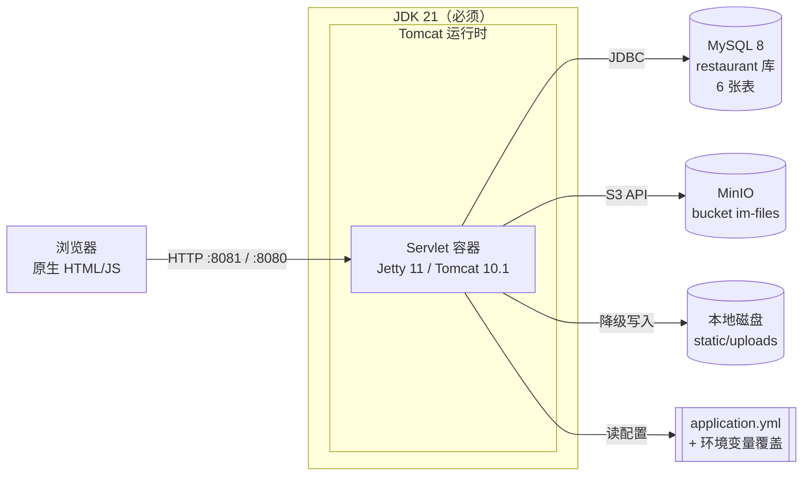

---

## 2. 应用启动初始化流程

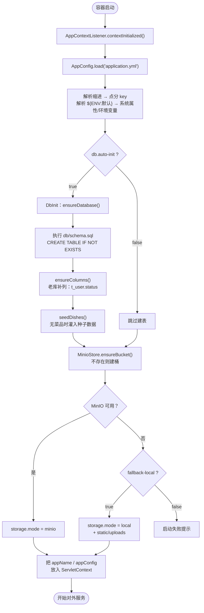

---

## 3. 请求进入：Filter 拦截链

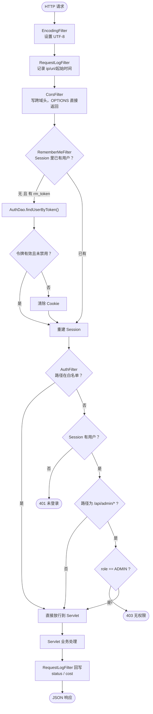

---

## 4. 登录：账号密码 + 记住我

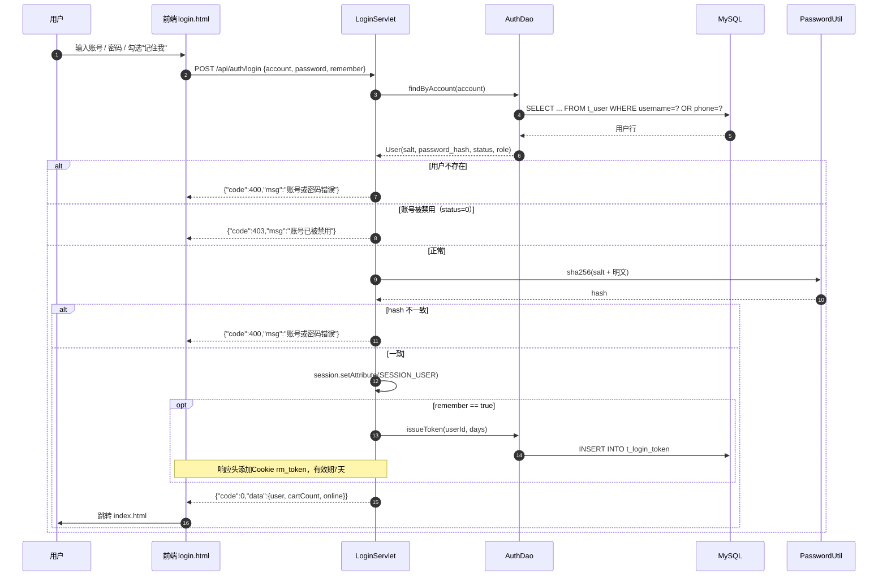

---

## 5. 登录：手机号验证码（首次自动注册）

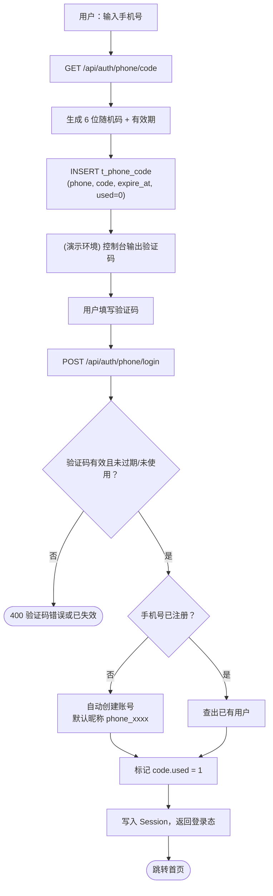

---

## 6. 浏览菜品 → 加购 → 下单（核心链路，含事务与库存）

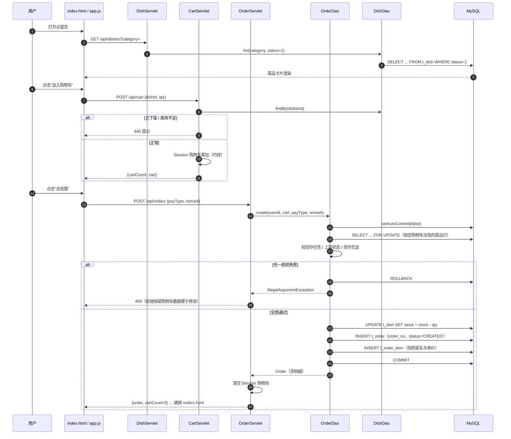

---

## 7. 订单状态流转（后台）

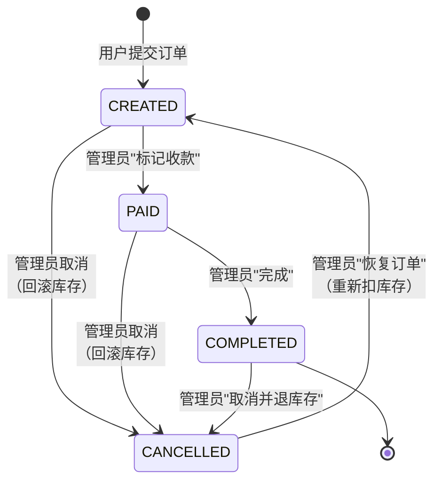

前端中文映射：`CREATED=待处理`、`PAID=已支付`、`COMPLETED=已完成`、`CANCELLED=已取消`。

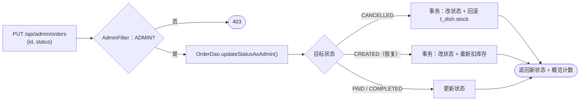

---

## 8. 头像 / 菜品图上传（含 MinIO 降级）

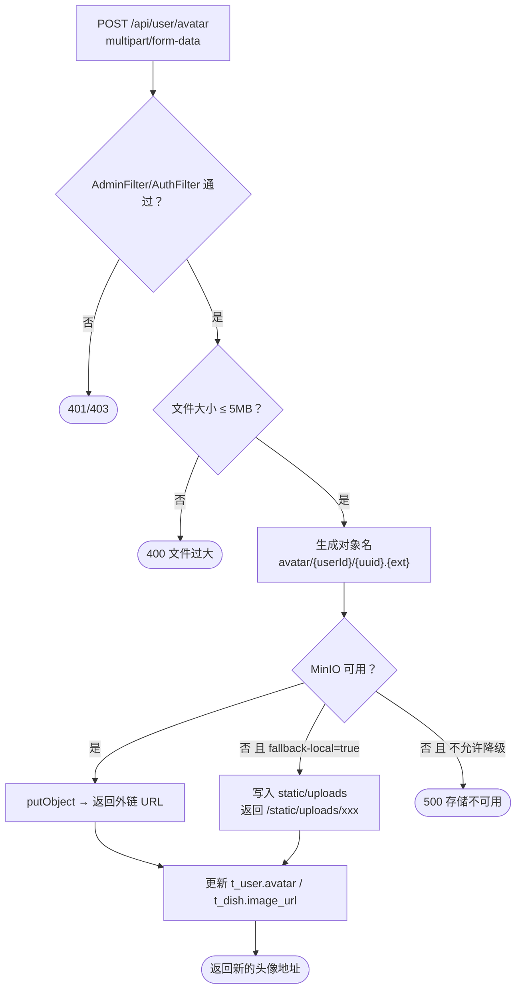

---

## 9. 在线人数与统计（Listener 旁路）

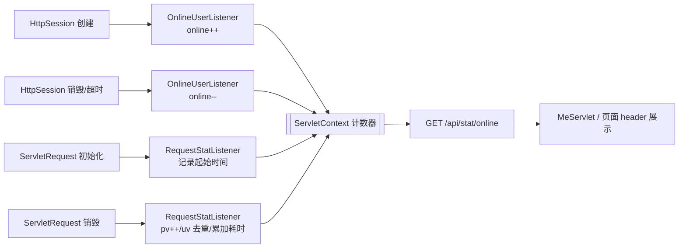

---

## 10. 错误处理统一出口

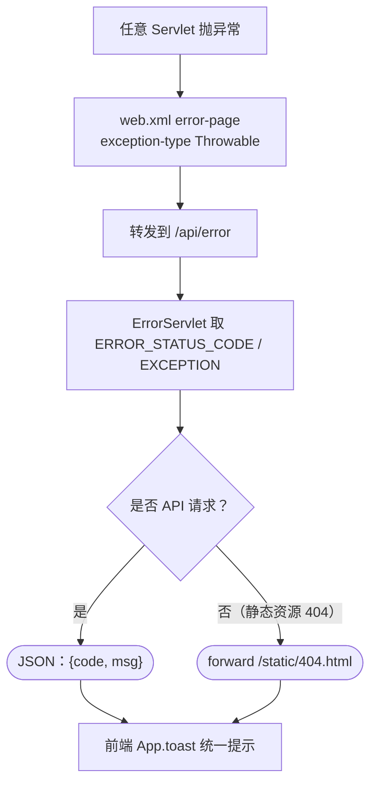

---

## 11. 后台管理四大模块（数据流）

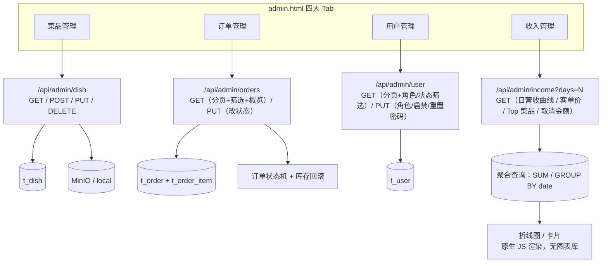

---

## 12. 全链路请求时序（前台 → 过滤器 → Servlet → DAO → 数据库 → 返回）

> 这是"一次 HTTP 请求完整生命周期"的总图，前面第 3、4、6 节都是它的局部展开。

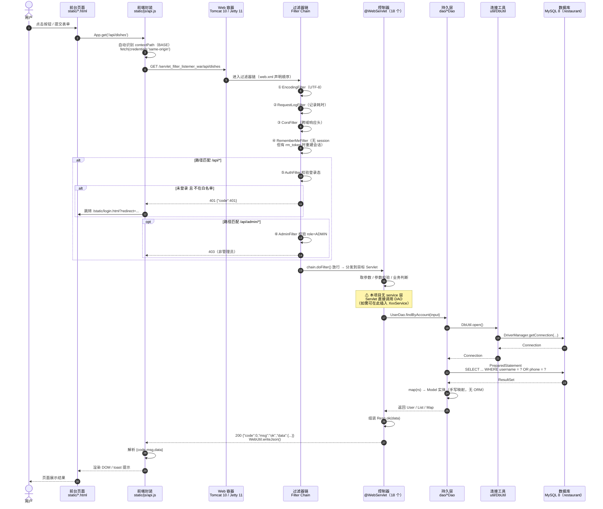

---

## 13. 分层架构与数据流向（含 service 层说明）

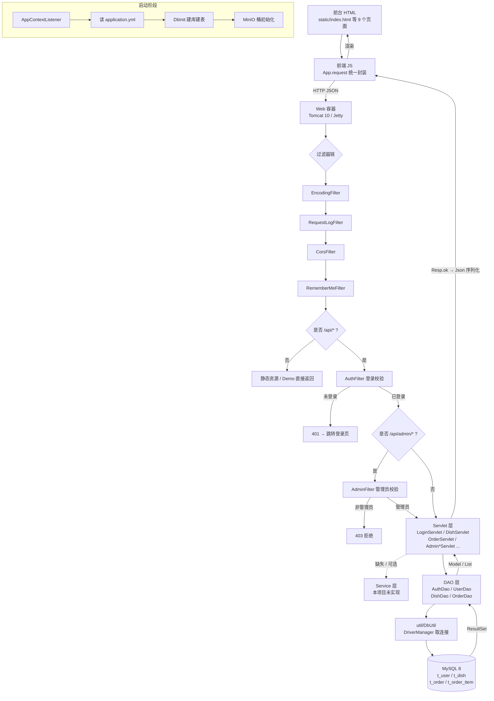

### 各层职责与现状

| 层次 | 本项目实现 | 说明 |
|---|---|---|
| 表现层 | `static/*.html` + `static/js/*.js` | 原生 HTML/JS，无框架；`api.js` 统一封装 fetch |
| 过滤器层 | `filter/` 6 个 | 编码、日志、跨域、自动登录、鉴权、管理员权限 |
| 控制器层 | `servlet/` 18 个 | `@WebServlet` 注解注册，负责取参/校验/响应 |
| **Service 层** | ❌ **不存在** | Servlet 直接调 DAO；业务逻辑散落在 Servlet 与 DAO 之间 |
| 持久层 | `dao/` 4 个 | 手写 JDBC + PreparedStatement，无 ORM、无连接池 |
| 数据源 | `util/DbUtil` | 唯一 `DriverManager.getConnection` 出口 |
| 数据库 | MySQL 8 | 6 张表，DDL 在 `db/schema.sql` |

### 若要补充 Service 层

```
Servlet（只管 HTTP：取参、鉴权、响应）
   ↓
Service（业务：校验、组合、事务边界）   ← 新增
   ↓
Dao（只管 SQL）
```

收益：把"扣库存 + 建订单 + 写明细 + 清购物车"收拢到 `OrderService.placeOrder()` 一处，可复用、可单测，事务边界也从 DAO 上移到 Service。
