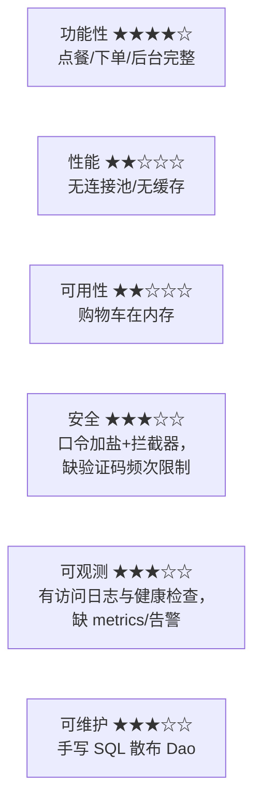
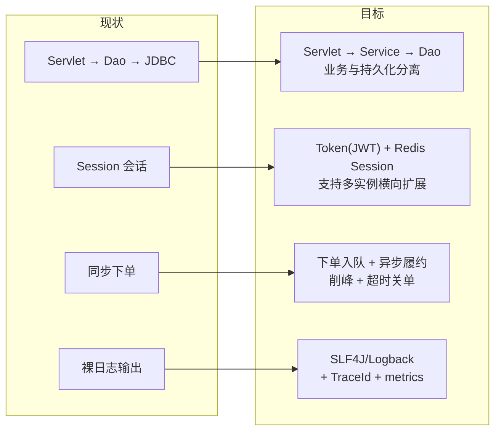
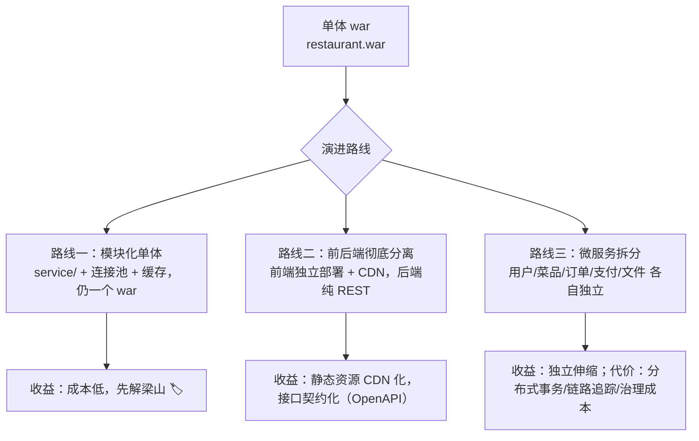
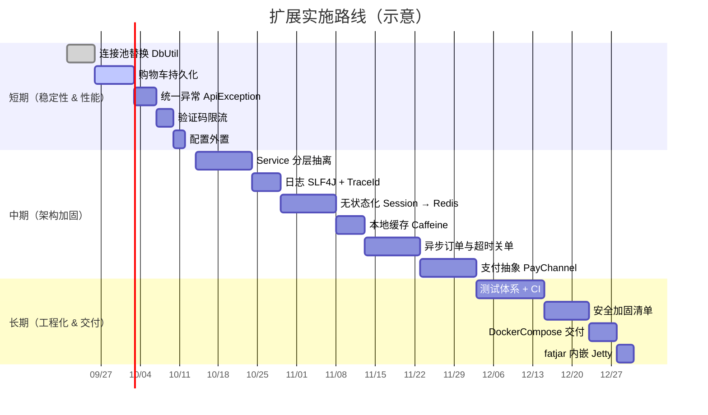

# 未来扩展规划

> 目标：在保持「零框架、原生 Servlet」教学/演示价值的前提下，按优先级解决真实生产短板。
> 每项给出：现状痛点 → 改造方案 → 需要改动的文件 → 收益/风险。

---
连接池、缓存和分层（Service/ORM），
## 0. 能力雷达（现状）

---

## 1. 短期（1～2 周，改动小、收益大）

| # | 事项 | 现状痛点 | 方案 | 涉及文件 |
|---|---|---|---|---|
| 1 | **连接池** | 每次请求都 `DriverManager` 新建连接，高并发连接数爆、延迟高 | 引入 HikariCP（或先自写简易池），`AppConfig` 增加 `db.pool.max-size/min-idle`，`DbUtil.open()` 改为取池连接，`close()` 归还 | `util/DbUtil.java`、`AppConfig.java`、`application.yml` |
| 2 | **购物车持久化** | 存 `SESSION_CART`，重启/换设备丢失 | 新增 `t_cart(dish_id, quantity)`；登录时将 Session 购物车合并入库（merge）；读购物车改为「库为主 + Session 兜底」 | 新增 `Cart`/`CartDao` 落库、`CartServlet`、`OrderServlet` |
| 3 | **统一异常处理** | 各 Servlet 自行 try/catch，错误码分散 | 抽出 `ApiException(code, msg)` + 基类 `BaseApiServlet` 模板方法；业务只抛异常，出口统一转 JSON | `util/Resp.java`、全部 Servlet |
| 4 | **验证码限流与失效** | `t_phone_code` 无频控，可被刷 | 同手机号 60s 内只能发一次、单 IP 每日上限、验证失败次数上限；清理过期数据定时任务 | `PhoneCodeServlet`、`AuthDao` |
| 5 | **事务/并发控制增强** | 仅在下单用事务；库存 `UPDATE ... WHERE stock>=qty` 更稳 | 下单改为条件更新判返回值实现乐观/悲观二选一；管理端改状态也包进事务 | `dao/OrderDao.java`、`dao/DishDao.java` |
| 6 | **配置外置** | yml 打进 war，改配置要在包内编辑 | 支持外部文件 `./config/application.yml` 或 `-Dapp.config=绝对路径` 优先加载 | `AppConfig.load()`、`README` |

---

## 2. 中期（1～2 月，架构加固）

| # | 事项 | 说明 | 关键设计 |
|---|---|---|---|
| 7 | **Service 层** | 目前业务逻辑混在 Servlet 里，难复用/难测试 | 新增 `service/`：`DishService`/`CartService`/`OrderService`/`UserService`；Servlet 只做参数校验与序列化；事务边界上移到 Service（用 ThreadLocal 绑定 Connection） |
| 8 | **无状态化 + Redis** | 依赖 HttpSession，无法多实例负载 | `rm_token` → 改 JWT（`jjwt`）或 Redis 存 Session；购物车本来就已计划入库；在线人数改 Redis 计数器；引入 `spring-session`? 不必，自写即可 |
| 9 | **异步订单** | 下单全链路同步，超时/支付回调无处安放 | 提交后立即返回订单号，落 `t_order` 后由内存队列/定时扫描处理「30 分钟未支付自动取消并回滚库存」；若引入 MQ（RabbitMQ/Kafka）做削峰与解耦 |
| 10 | **缓存** | 每次请求直查 DB | 菜品列表/分类走 Caffeine 本地缓存（`Cache-Aside`），后台增删改时失效；多实例场景换 Redis + 发布订阅失效 |
| 11 | **支付闭环** | `pay_type` 仅有 `CASH/WECHAT/ALIPAY` 枚举，无真实支付 | 预留支付网关抽象 `PayChannel`（`createOrder`/`query`/`refund`）+ 回调验签；订单状态扩 `PAYING`、退款单表 `t_refund` |
| 12 | **日志与监控** | `System.out` 裸打印 | 换 SLF4J + Logback（滚动文件、异步 Appender）；接入 Micrometer 暴露 `/api/metrics`（Prometheus 文本）， Grafana 看板：QPS、P95、下单成功率、DB 池水位 |
| 13 | **国际化/多规格** | 菜品无规格与口味选项 | 新增 `t_dish_spec`（规格/加价）、`t_order_item_spec`；前端规格选择器；下单金额按规格重算 |
| 14 | **权限细化** | 只有 `USER/ADMIN` | 引入 `t_role`/`t_permission`/`t_role_permission`，`AdminFilter` 改为基于权限码（如 `order:refund`）判定 |

---

## 3. 长期（方向性演进）

| 方向 | 内容 | 触发条件 |
|---|---|---|
| **可测试性** | 目前无单测；引入 JUnit5 + Mockito + Testcontainers（MySQL/MinIO 真容器）跑集成测试，CI 上 `mvn verify` | 中期任意阶段都应尽快补 |
| **API 契约化** | 手写 OpenAPI 描述或用 `smallrye-open-api` 生成 Swagger UI，前后端联调与文档自动化 | 前端需要独立开发时 |
| **安全加固** | HTTPS 强制、CSRF Token、`SameSite=Lax` Cookie、登录失败锁定、操作审计表 `t_audit_log`、敏感数据脱敏日志 | 上公网/真实用户前 |
| **文件存储治理** | MinIO 外链直传签名 URL、图片压缩/WebP、缩略图、`t_file` 统一管理元数据与引用计数 | 图片量增长后 |
| **高并发下单** | Redis Lua 预扣库存 + MQ 异步落库 + 幂等去重（`order_no` 唯一索引 + 请求去重表） | 促销/秒杀场景 |
| **容器化交付** | Dockerfile（多阶段构建）→ `docker compose`（app + mysql + minio）+ 健康检查；K8s Deployment/HPA/Ingress | 需要多环境快速交付 |
| **胖 jar 交付** | 增加 `fatjar`  profile：内嵌 Jetty + `maven-shade-plugin`，产出 `restaurant-boot.jar`（`java -jar` 即可跑，无需 Tomcat） | 演示/教学希望零容器依赖 |
| **数据智能** | 基于 `t_order_item` 做销量预测、关联推荐（"点了宫保鸡丁的人还点了…"）、经营日报自动推送 | 数据积累到一定规模 |

---

## 4. 实施路线图

---

## 5. 优先级建议（如果只做 5 件事）

1. **连接池**（`DbUtil`）— 一行取连接改一处，收益最大
2. **Service 分层 + 统一异常** — 让代码从"能用"变成"可维护"
3. **购物车落库 + 无状态 Session** — 决定能否横向扩展
4. **测试 + CI** — 后续所有重构的安全网
5. **日志/监控** — 出问题能定位

> 保守取舍：若目标是课程作业/面试演示，建议停在「短期 + Service 分层」即可，保留「零框架」的可讲解性；若目标是真实上线，则必须完成「连接池、购物车落库、无状态化、日志监控、安全加固」五项。
